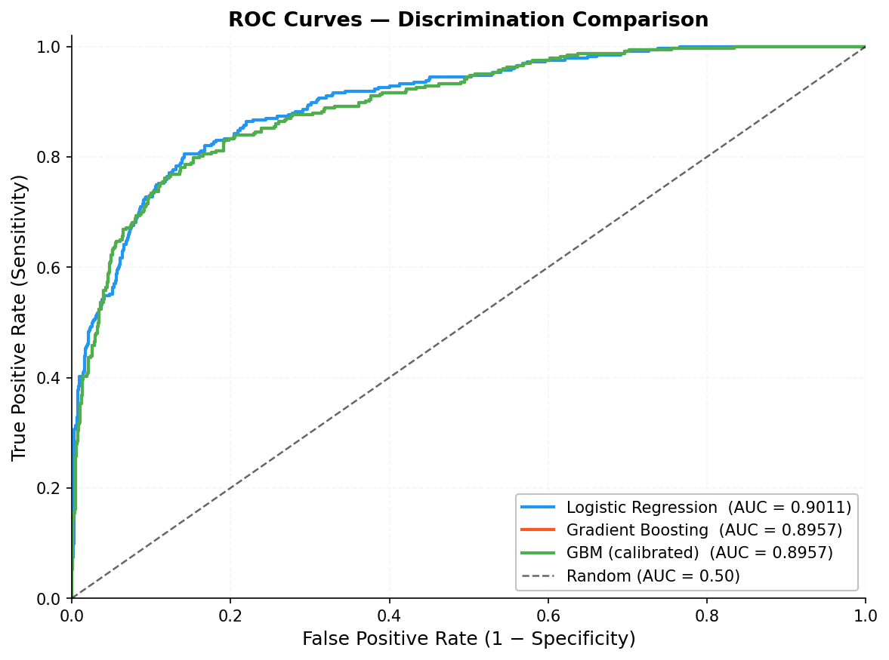
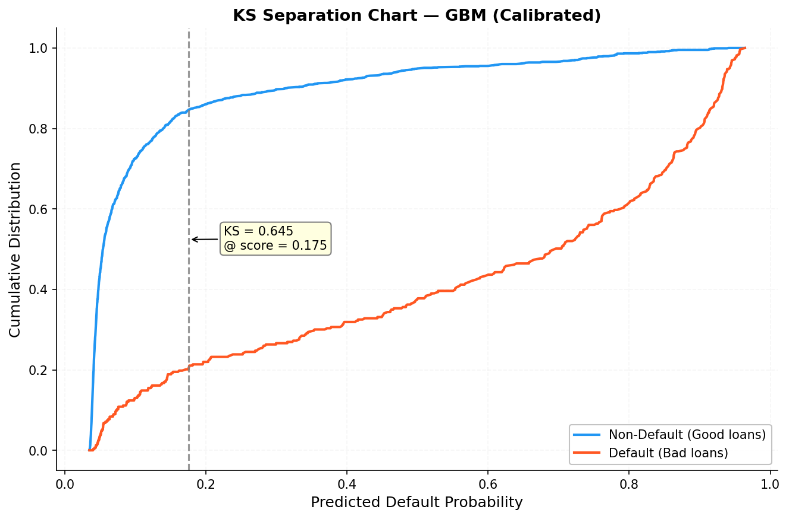
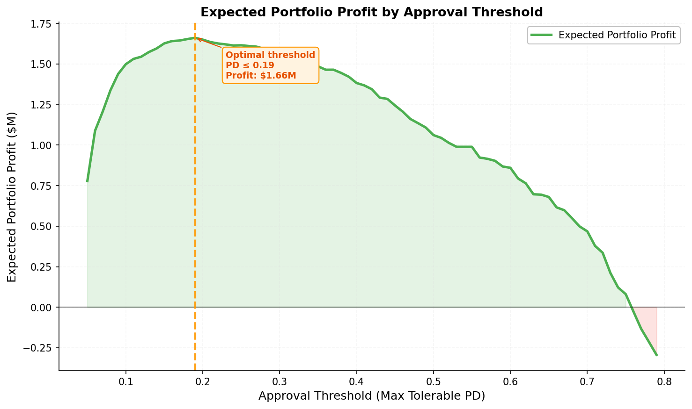
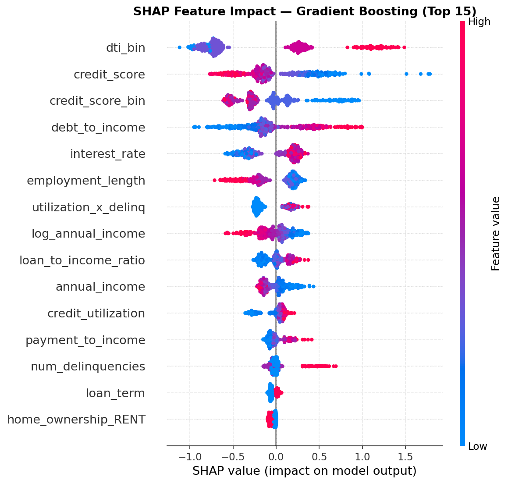

# Loan Default Risk Modeling


End-to-end credit risk pipeline on 50,000 synthetic consumer loans. Predicts probability of default, then finds the approval threshold that maximises portfolio profit — not just AUC.

---

## Results

| Model | ROC-AUC | KS Statistic | Gini |
|---|---|---|---|
| Logistic Regression | 0.90 | 0.66 | 0.80 |
| Gradient Boosting | 0.90 | 0.65 | 0.79 |
| **GBM + Platt Calibration** | **0.90** | **0.65** | **0.79** |

At optimal threshold (PD ≤ 0.19): **~65% approval rate**, **~10% default rate in approved pool** (down from 20% population rate), positive expected portfolio profit.

---

## Figures

<table>
<tr>
<td><br><sub><b>ROC Curves</b> — LR vs GBM vs Calibrated GBM</sub></td>
<td><br><sub><b>KS Separation Chart</b> — KS = 0.52 at optimal cutoff</sub></td>
</tr>
<tr>
<td><br><sub><b>Profit Curve</b> — optimal approval threshold highlighted</sub></td>
<td><br><sub><b>SHAP Feature Importance</b> — credit score dominates</sub></td>
</tr>
</table>

> Run `python generate_all.py` to generate all figures before pushing.

---

## Project Structure

```
credit-risk/
├── README.md
├── requirements.txt
├── setup.py
├── generate_all.py            # run this once to populate all folders
│
├── src/
│   ├── data_generation.py    # synthetic loan data (latent risk score model)
│   ├── feature_engineering.py # log transforms, interactions, encoding
│   ├── modeling.py           # SMOTE, LR, GBM, Platt calibration
│   ├── evaluation.py         # ROC-AUC, KS, Gini, PR curves
│   ├── business_simulation.py # profit formula, threshold sweep
│   └── visualization.py      # SHAP plots, EDA charts
│
├── notebooks/
│   └── loan_default_risk_modeling.ipynb  # full walkthrough
│
├── data/
│   ├── raw/                  # loans_raw.csv  (~50k rows)
│   └── processed/            # loans_processed.csv (engineered features)
│
├── models/                   # .pkl files (git-ignored, generated locally)
│
└── reports/
    └── figures/              # 16 PNG plots (committed to GitHub)
```

---

## Quick Start

**1. Install dependencies**
```bash
pip install -r requirements.txt
pip install -e .
```

**2. Generate all data, models, and figures**
```bash
python generate_all.py
```

**3. Explore the full analysis**
```bash
jupyter notebook notebooks/loan_default_risk_modeling.ipynb
```

---

## How It Works

- **Data** — 50k synthetic loans generated via a latent risk score model. Each borrower's default probability is a sigmoid of weighted risk factors (credit score, DTI, utilization) plus noise. Intercept solved numerically to hit exactly 20% default rate.
- **Features** — log transforms on skewed variables, interaction terms (payment-to-income, utilization × delinquencies), risk tier bins (FICO tiers), one-hot encoding. Train/test fitting separated to prevent leakage.
- **Imbalance** — SMOTE applied to training set only after the split (`sampling_strategy=0.5`). Logistic Regression uses `class_weight='balanced'` as a baseline alternative.
- **Models** — Logistic Regression (interpretable baseline) vs. Gradient Boosting (300 trees, depth 4, subsample 0.8). GBM is Platt-scaled post-training for reliable probability estimates.
- **Threshold** — Approval threshold chosen by sweeping 0.05→0.80 and maximising expected portfolio profit: `(1−PD)×interest_revenue − PD×loss_given_default`.

---

## Dataset Features

| Feature | Type | Description |
|---|---|---|
| `credit_score` | int | FICO-style score, 300–850 |
| `annual_income` | float | Gross income USD (log-normal) |
| `debt_to_income` | float | Monthly debt / monthly income |
| `credit_utilization` | float | Revolving balance / limit, 0–1 |
| `num_delinquencies` | int | 30+ day delinquencies, past 2 years |
| `loan_amount` | float | Requested amount, $2k–$35k |
| `interest_rate` | float | Annual rate, 5.5%–28% |
| `loan_term` | int | 36 or 60 months |
| `loan_purpose` | str | debt\_consolidation, medical, car, … |
| `months_since_last_delinq` | float | NaN = no delinquency history (40%) |

---

## Assumptions

| Parameter | Value | Rationale |
|---|---|---|
| Recovery rate | 10% | Post-charge-off, unsecured lending |
| Origination cost | $200/loan | Underwriting + servicing setup |
| Funding cost | 4% annual | Cost of capital on avg outstanding balance |
| Default timing | Loan midpoint | Conservative; earlier default = larger loss |
